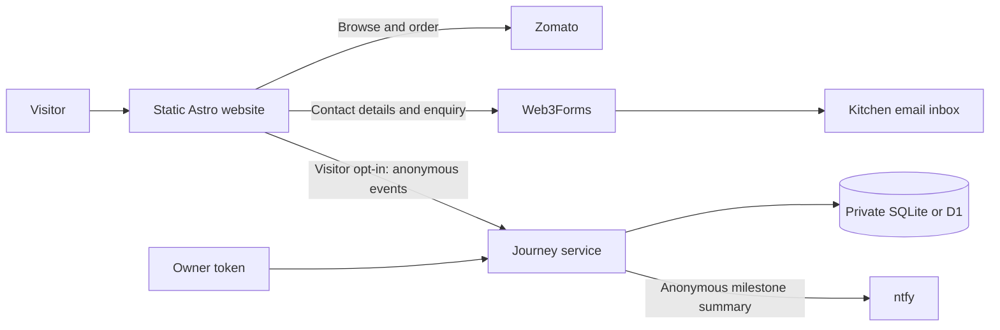

# Website architecture

9 October 2026. Implementation follows the approved Kitchen Studio direction and PRD.

## Stack and boundaries

Astro 7.3.8, strict TypeScript 6, Astro content collections with Zod 4, custom layered responsive CSS, locally served Outfit/Work Sans variable fonts, Lucide icons, GSAP 3.15 and Three.js 0.186. Sharp produces WebP derivatives from approved source images. Node 24 runs checks and the local SQLite journey service. Dependencies are pinned by `package-lock.json`.

Static pages render useful menu content without JavaScript. One small client module enhances search, filters, native-dialog navigation, sharing, installation, enquiry submission and consent. GSAP and Three.js are dynamically imported only when motion is appropriate. The Three.js module composes matrices for photo/mascot perspective on pointer devices; there is no orange halo, WebGL context or continuous animation loop.

The shared public catalogue is `src/data/menu.json`: 23 records, five website categories. Fields are explicitly allowed; no price/private source fields are exported. `scripts/prepare-assets.mjs` reads the owner workspace catalogue and photo collection to regenerate assets; it is a maintainer tool and does not run in GitHub CI. Source files are preserved; `ASSET_SOURCES.json` records hashes and paths relative to the photo collection.

## Pages and navigation

Home → searchable menu → category or dish → Zomato. Desktop navigation: Home, Menu, Our kitchen, Food talk. Mobile navigation: Home, Menu, More, with a separate persistent Order on Zomato action. More and the footer expose Contact, Sundargarh and Privacy. Party enquiries link to `/contact/?type=party`.

45 HTML routes: home; menu; five categories; 23 dishes; about; Sundargarh; contact; privacy; offline; 404; blog index and six articles; festival hub; private owner-report shell. Manifest, robots and RSS are generated endpoints. Canonical and image sitemaps are validated during each production build. The owner shell is noindex and contains no report or credential until authenticated. Festival season is linked from the home, blog, More menu and footer.

## Form and journey data

The free Web3Forms key is designed to be public. Browser submissions go directly to its API. Free submissions are not proxied through the Worker: Web3Forms documents restrictions on server-side proxy use. A browser success response produces an `enquiry_reported` event only for visitors who allowed measurement. It is not server-verified attribution. Contact names/email/phone/messages never enter the journey database or ntfy summaries.

The optional service uses the same handler with Node SQLite locally and Cloudflare Worker/D1 in production. It allows only configured origins, known routes/event types/dishes, bounded JSON and random identifiers; rejects unexpected fields; deduplicates events; limits requests with hashed network-address/hour identifiers; and retains events for 30 days with daily production cleanup. Notifications announce contact/email link clicks, Zomato handoffs and browser-reported enquiry success. Menu/category/dish views, search usage without its text, category filters and form starts/type changes/submit attempts/failures are recorded in the anonymous journey and included in milestone summaries. Credentials and the ntfy topic are backend-only.

The free ntfy channel is random and unlisted, not access-controlled private. Notifications contain anonymous route sequences only. A paid/access-controlled topic can be substituted later without changing the frontend. Completed Zomato orders stay unknown: no order-completion event is invented.

## SEO and caching

Dish/category pages, useful original articles, local Sundargarh copy, page-specific metadata and price-free Restaurant/WebSite/WebPage/BreadcrumbList/MenuItem/BlogPosting schema. Restaurant address publishes city, region and country only, matching the owner’s publication choice. Google local-business rich-result eligibility is not claimed without its required business facts. No invented reviews, ratings, hours or offers.

All paths respect Astro’s base configuration. Manifest scope/start URL and worker scope remain within that base. Service-worker navigation is network-first with a cached page/offline fallback; same-origin public assets are cached as visited. Queries do not fragment the page cache. External forms, journey calls, Zomato and the owner report are not cached. The UI explains offline limitations and offers an update when a new worker waits.

## Primary references

Production: GitHub Pages publishes the checked static artifact from `main` to `https://milanbeherazyx.github.io/bhuklagla.github.io/`. Canonicals, assets, manifest and service worker share that project base path. The separate Worker/D1 is pending Bhuk Lagla's own Cloudflare account; production anonymous measurement stays disabled until its endpoint is configured. See `RELEASE.md` and `SEO_LAUNCH.md`.

- [Astro static deployment](https://docs.astro.build/en/guides/deploy/github/)
- [Astro content collections](https://docs.astro.build/en/guides/content-collections/)
- [Web3Forms troubleshooting and public-key guidance](https://docs.web3forms.com/getting-started/troubleshooting)
- [ntfy publishing](https://docs.ntfy.sh/publish/)
- [Cloudflare Worker secrets](https://developers.cloudflare.com/workers/configuration/secrets/)
- [Google local-business structured data](https://developers.google.com/search/docs/appearance/structured-data/local-business)
