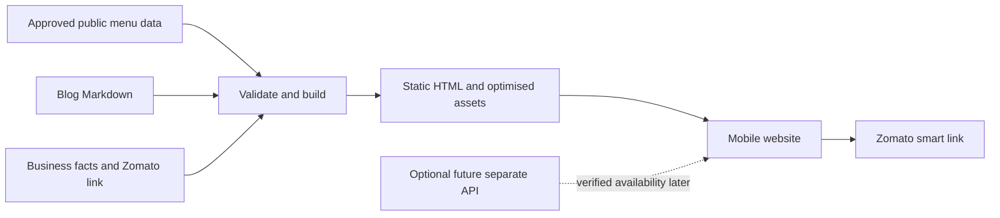

> Historical design discussion. Superseded by the approved Kitchen Studio full build; see PRD.md, ARCHITECTURE.md and OPERATIONS.md for current decisions.

# Website proposal for discussion

9 October 2026. Milan approved this direction in principle and requested a small demo before full implementation. Follow `WEBSITE_BRIEF.md`; the final PRD and full website remain pending demo review. The demo explores Cream Pop and After Dark, not production functionality.

## Product and pages

A friendly, energetic local food catalogue: budget-conscious, appetising and easy to use. Public descriptions and photos lead to Zomato; prices, actual eligible offers and transactions remain there. Private kitchen information never enters the website.

| Page                         | Purpose                                                                                                  |
| ---------------------------- | -------------------------------------------------------------------------------------------------------- |
| Home `/`                     | Mascot, distinctive food/motion hero, short positioning, category entry points and visible Zomato action |
| Menu `/menu/`                | Search, filters, photo-led cards and concise descriptions                                                |
| Category pages               | Pizza, sandwiches, snacks, Maggi and pasta: useful browsing and specific search intent                   |
| Dish pages                   | Shareable, indexable descriptions generated from shared data, with photos and Zomato handoff             |
| About `/about/`              | Local identity, pure-veg/egg-free facts and simple public cooking-method explanation                     |
| Sundargarh `/sundargarh/`    | One useful local page with verified facts and menu links                                                 |
| Blog `/blog/` and articles   | Helpful local food content connected to the menu                                                         |
| Contact and FAQs `/contact/` | Verified hours/contact information and answers about ordering                                            |
| Utility pages                | 404, suitable privacy information and an honest offline fallback                                         |

Proposed mobile navigation: **Home / Menu / More**, with recognisable SVG icons plus short labels. Blog, About and Contact live under More. Keep **Order on Zomato** visible as a separate primary action. Use food-photo category buttons, comfortable roughly 48px tap areas, readable type, safe-area clearance and accessible labels. Never require animation completion, a swipe or installation to reach the menu.

The menu remains useful without JavaScript; interactive search/filtering enhances it. Generated item pages are real indexable pages, not modal-only content.

## Palette, typography and motion

Recommendation: bright cream browsing surfaces, charcoal hero/header accents and orange emphasis, realistic food photos and the approved cartoon mascot. This differs from The Oven Vibe's red/navy/Inter design. A dark hero can lead into a bright catalogue.

| Colour     | Value     | Role                                    |
| ---------- | --------- | --------------------------------------- |
| Charcoal   | `#171717` | Text and dark hero contrast             |
| Cream      | `#FFF0CF` | Main browsing surface                   |
| Orange     | `#F56A16` | Accents and tactile controls            |
| White      | `#FFFFFF` | Clean cards and content surfaces        |
| Deep green | `#236B39` | Proposed website-only veg/status accent |

The first four colours come from the existing brand handoff's proposed normalisations; retain the logo palette family. Check actual contrast before finalising tokens. Do not assume white small text on orange is readable; start with charcoal labels. Availability needs words/icons as well as colour.

Typography proposal: [Fredoka](https://fonts.google.com/specimen/Fredoka) for short expressive headings and [Nunito Sans](https://fonts.google.com/specimen/Nunito+Sans) for readable body/control text. Preserve the actual logo artwork rather than replacing its custom lettering. Verify font licences before packaging, self-host only needed weights, and use a real compatible script font if Odia is selected. Website languages are still open.

One signature hero scene: a mascot-led composition with depth, gently floating food/photo planes, a short entrance and optional controlled tilt. Existing photos are 2D; texture planes and CSS perspective are not genuine reconstructed 3D dishes. True food geometry would require separately approved assets.

Use GSAP for coordinated sequences, CSS/WAAPI for small press effects and supported view transitions. Reserve Three.js for a deferred hero module. Menu text stays outside canvas, readable and crawlable. Cap rendering resolution, pause off-screen work and support a still-image/reduced-motion fallback. Never hijack scrolling. The [Three.js responsive guide](https://threejs.org/manual/pages/responsive.html) explains the GPU cost of high pixel-density rendering; [GSAP](https://gsap.com/docs/v3/) provides a core with optional plugins.

A skill database suggested app-store buttons and generic ratings; those patterns were rejected because this is a Zomato catalogue, not a native app download or a site with verified testimonial data.

## Modern stack recommendation

| Area             | Proposal                                                                           |
| ---------------- | ---------------------------------------------------------------------------------- |
| Framework        | Current stable Astro, pinned when implementation starts                            |
| Types/build      | TypeScript strict mode, Astro/Vite and supported Node LTS                          |
| Styling          | Tailwind CSS 4.x plus a small brand-token/motion layer                             |
| Menu interaction | Small TypeScript modules; add an island framework only for demonstrated complexity |
| Motion/3D        | GSAP and a deferred Three.js module                                                |
| Content          | Validated public menu JSON and Astro content collections for Markdown blog posts   |
| Images           | Build-time Sharp/Astro derivatives, responsive WebP/AVIF and compatible fallbacks  |
| PWA              | Manifest, branded icons, standalone display and carefully scoped service worker    |
| Checks           | Playwright for key user flows, accessibility checks and Lighthouse CI              |
| Workflow         | GitHub, a lockfile, focused pull requests and GitHub Actions                       |

[Astro islands](https://docs.astro.build/en/concepts/islands/) keep most content as HTML and activate selected interactive components. [Content collections](https://docs.astro.build/en/guides/content-collections/) support schema validation and typed content; [Tailwind/Vite](https://tailwindcss.com/docs/installation/using-vite) compiles styles without a browser CSS runtime.

Other options reviewed: [Next.js static export](https://nextjs.org/docs/app/guides/static-exports) and [SvelteKit static generation](https://svelte.dev/docs/kit/adapter-static). Both can produce static files. Next.js server-dependent features do not work in its static export. SvelteKit is reasonable if a deeply interactive app becomes the main product. Astro is the recommended fit for the current catalogue/blog journey; a framework change alone does not make the website better.

## Architecture and scalability

Separate public menu data, business/link configuration, reusable components, route templates, SEO generation and optional effects. Use stable Bhuk Lagla identifiers. Build output must contain only approved public fields: exclude prices, recipes and operational data.

At launch, authorised catalogue changes in GitHub trigger a rebuild. Public search indexes contain names, categories and descriptions only. Shareable category/item pages survive later backend additions.

Do not present a static flag as live Zomato stock. Either maintain public availability manually with a genuine update time, or show **Check availability on Zomato** until a verified feed exists. Offline views label cached content; Zomato ordering and live availability require connectivity.

A future separate API can add verified availability, content management or later approved business features behind a versioned interface. Keep this brand's accounts, credentials and data separate. Select backend/database technologies once requirements exist; do not add a backend or ingredient inventory subsystem now. GitHub Pages cannot run an API service.

## Organic SEO and marketing

Target relevant local intent: budget/veg pizza in Sundargarh, grilled sandwiches, fries, Maggi, pasta and actual menu names. Use accurate titles, headings, canonicals, social previews, crawlable descriptions, descriptive images, internal links, structured data and sitemap/robots configuration. Menu schema can describe items without prices; do not invent Offers or reviews to satisfy a rich-result format.

Blogs should answer real local questions, connect to dishes and explain public cooking methods without recipes. Avoid near-duplicate keyword/location pages. No ads or paid campaign are proposed.

[Google's SEO guide](https://developers.google.com/search/docs/fundamentals/seo-starter-guide) says first place is not automatic and changes may take hours to months. [Local ranking guidance](https://support.google.com/business/answer/7091?hl=en) identifies relevance, distance and prominence. Include an eligible, complete Bhuk Lagla Google Business Profile, consistent public facts, genuine customer feedback and local references. Do not reuse The Oven Vibe's profile or buy/incentivise reviews.

Early organic launch proposal, after content/channel approval:

- Prepare verified business details, Search Console ownership, sitemap and consistent brand links.
- Share a short mascot/food reveal and a clear menu launch through owner-authorised accounts, with local Sundargarh context.
- Encourage voluntary sharing through existing followers and local relationships; no mass messages or fake testimonials.
- Use approved packaging/menu QR material where practical.
- Follow with real dish/category spotlights and a helpful blog article.
- Review indexing, impressions, visits and outbound taps; these do not prove completed Zomato orders.

For hype, protect recipes, keep prices on Zomato, and let actual customer eligibility determine offers there. Tease future specials only once genuinely approved. Keep the launch menu discoverable. Proposed CTA: **See available offers on Zomato**. Do not claim every visitor receives a personalised discount, invent scarcity or pretend a smart link generates an offer. Item-specific deep links and basket transfers are not verified.

## What “better than The Oven Vibe” means

The source Lighthouse configuration accepts minimum scores of 70 performance, 85 accessibility and 90 SEO. Those are thresholds, not measured current site scores. Benchmark comparable live routes under matched conditions before claiming an improvement.

Proposed goals: median mobile Lighthouse performance at least 90 on agreed core pages; accessibility/SEO at least 95; no sideways overflow; clear text-labelled navigation; easy menu discovery and correct Zomato handoff. Field goals are 75th-percentile LCP at most 2.5 seconds, INP at most 200ms and CLS at most 0.1, as described by [Core Web Vitals](https://web.dev/articles/vitals). New sites may initially lack field data; lab results must not be called real-user results.

Compare search impressions, organic clicks and outbound-tap rate over matched periods. Website analytics cannot by itself prove Zomato sales or offer redemption. A PWA remains a website; installation varies by browser, and [iPhone uses Add to Home Screen](https://web.dev/learn/pwa/installation).

## GitHub hosting details to resolve

The repo is `milanbeherazyx/bhuklagla.github.io`. Its name does not create the domain `bhuklagla.github.io`. Normal project-site rules would give `https://milanbeherazyx.github.io/bhuklagla.github.io/`, unless an appropriate owner/account arrangement or custom domain is selected. [Astro's GitHub guide](https://docs.astro.build/en/guides/deploy/github/) describes project URLs and base-path handling.

[GitHub Pages limits](https://docs.github.com/en/pages/getting-started-with-github-pages/github-pages-limits) restrict sites primarily facilitating commercial transactions. Because this site's purpose includes directing Zomato orders, resolve hosting suitability before fixing Pages as the production host. This is a specific concern, not a change to the user's preference: keep source/content/workflow on GitHub and discuss production hosting separately if needed. No account, domain or hosting setting has been changed.

## Next discussion

Agree on the public brand promise and languages, then review pages/design and stack. Convert approved decisions into a PRD with launch scope, requirements, acceptance criteria and implementation phases. No final PRD or website has been created.
